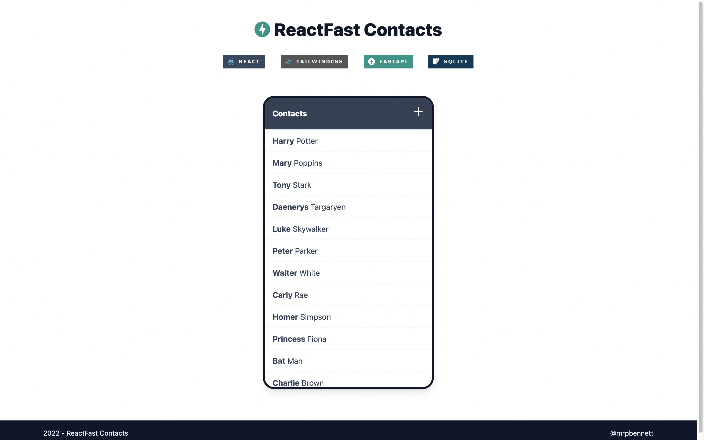

# :zap: ReactFast Contacts


[](https://github.com/psf/black)


A fullstack CRUD application built with FastAPI, SQLite for the backend and React with TailwindCSS for the user interface.



## Run Locally 💻

First clone the whole repo.

```bash
git clone https://github.com/mrpbennett/contact_fastapi.git
```

Once cloned you will need to install the depencies for the back end as well as the front end instructions are:

- [Firing up the backend](backend/README.md)
- [Firing up the frontend](frontend/README.md)

You will need to start the back end before the front to see the populated data within the UI.
